# Awesome Codex Pets

Ready-to-install pet packages for Codex Desktop, with a small `npx` CLI and
scripts for catalog validation, preview GIF generation, and README gallery
updates.

The catalog is generated from pet packages under `pets/`, then rendered into a
README gallery with install commands and animated previews.

## Usage

List available pets:

```bash
npx awesome-codex-pets list
```

Install a pet into Codex:

```bash
npx awesome-codex-pets install <pet-id>
```

Install and mark it as active:

```bash
npx awesome-codex-pets apply <pet-id>
```

Direct install from GitHub raw files:

```bash
curl -fsSL https://raw.githubusercontent.com/huaqingai/awesome-codex-pets/main/scripts/install-pet.sh | bash -s -- <pet-id>
```

Codex loads custom pets from `${CODEX_HOME:-$HOME/.codex}/pets/<pet-id>`.
`apply` installs the package and writes an active marker at
`${CODEX_HOME:-$HOME/.codex}/pets/.active-pet.json`. If a Codex Desktop build
does not expose a writable pet-selection setting, choose the installed pet from
Codex's UI after installation.

## Pet Catalog

<!-- PET_CATALOG_START -->
### Anime Characters

<table>
  <tr>
    <th>Name</th>
    <td colspan="5"><a href="https://github.com/huaqingai/awesome-codex-pets/tree/main/pets/bocchi--lingxiaotian">Bocchi</a> - by <a href="https://github.com/legeling">@Lingxiaotian</a> - Anime Characters</td>
  </tr>
  <tr>
    <th>Install</th>
    <td colspan="5"><code>npx awesome-codex-pets install bocchi--lingxiaotian</code><br/><code>curl -fsSL https://raw.githubusercontent.com/huaqingai/awesome-codex-pets/main/scripts/install-pet.sh | bash -s -- bocchi--lingxiaotian</code></td>
  </tr>
  <tr>
    <th>Action</th>
    <th>Idle</th><th>Waving</th><th>Running</th><th>Waiting</th><th>Review</th>
  </tr>
  <tr>
    <th>Preview</th>
    <td></td><td></td><td></td><td></td><td></td>
  </tr>
</table>

<table>
  <tr>
    <th>Name</th>
    <td colspan="5"><a href="https://github.com/huaqingai/awesome-codex-pets/tree/main/pets/dnf-female-ammo--qunboo">女弹药Q</a> - by <a href="https://github.com/QunBoo">@QunBoo</a> - Anime Characters</td>
  </tr>
  <tr>
    <th>Install</th>
    <td colspan="5"><code>npx awesome-codex-pets install dnf-female-ammo--qunboo</code><br/><code>curl -fsSL https://raw.githubusercontent.com/huaqingai/awesome-codex-pets/main/scripts/install-pet.sh | bash -s -- dnf-female-ammo--qunboo</code></td>
  </tr>
  <tr>
    <th>Action</th>
    <th>Idle</th><th>Waving</th><th>Running</th><th>Waiting</th><th>Review</th>
  </tr>
  <tr>
    <th>Preview</th>
    <td></td><td></td><td></td><td></td><td></td>
  </tr>
</table>

<table>
  <tr>
    <th>Name</th>
    <td colspan="5"><a href="https://github.com/huaqingai/awesome-codex-pets/tree/main/pets/firefly--lingxiaotian">Firefly</a> - by <a href="https://github.com/legeling">@Lingxiaotian</a> - Anime Characters</td>
  </tr>
  <tr>
    <th>Install</th>
    <td colspan="5"><code>npx awesome-codex-pets install firefly--lingxiaotian</code><br/><code>curl -fsSL https://raw.githubusercontent.com/huaqingai/awesome-codex-pets/main/scripts/install-pet.sh | bash -s -- firefly--lingxiaotian</code></td>
  </tr>
  <tr>
    <th>Action</th>
    <th>Idle</th><th>Waving</th><th>Running</th><th>Waiting</th><th>Review</th>
  </tr>
  <tr>
    <th>Preview</th>
    <td></td><td></td><td></td><td></td><td></td>
  </tr>
</table>

<table>
  <tr>
    <th>Name</th>
    <td colspan="5"><a href="https://github.com/huaqingai/awesome-codex-pets/tree/main/pets/frieren--lingxiaotian">Frieren</a> - by <a href="https://github.com/legeling">@Lingxiaotian</a> - Anime Characters</td>
  </tr>
  <tr>
    <th>Install</th>
    <td colspan="5"><code>npx awesome-codex-pets install frieren--lingxiaotian</code><br/><code>curl -fsSL https://raw.githubusercontent.com/huaqingai/awesome-codex-pets/main/scripts/install-pet.sh | bash -s -- frieren--lingxiaotian</code></td>
  </tr>
  <tr>
    <th>Action</th>
    <th>Idle</th><th>Waving</th><th>Running</th><th>Waiting</th><th>Review</th>
  </tr>
  <tr>
    <th>Preview</th>
    <td></td><td></td><td></td><td></td><td></td>
  </tr>
</table>

<table>
  <tr>
    <th>Name</th>
    <td colspan="5"><a href="https://github.com/huaqingai/awesome-codex-pets/tree/main/pets/mahiro--lingxiaotian">Mahiro</a> - by <a href="https://github.com/legeling">@Lingxiaotian</a> - Anime Characters</td>
  </tr>
  <tr>
    <th>Install</th>
    <td colspan="5"><code>npx awesome-codex-pets install mahiro--lingxiaotian</code><br/><code>curl -fsSL https://raw.githubusercontent.com/huaqingai/awesome-codex-pets/main/scripts/install-pet.sh | bash -s -- mahiro--lingxiaotian</code></td>
  </tr>
  <tr>
    <th>Action</th>
    <th>Idle</th><th>Waving</th><th>Running</th><th>Waiting</th><th>Review</th>
  </tr>
  <tr>
    <th>Preview</th>
    <td></td><td></td><td></td><td></td><td></td>
  </tr>
</table>

<table>
  <tr>
    <th>Name</th>
    <td colspan="5"><a href="https://github.com/huaqingai/awesome-codex-pets/tree/main/pets/mikoto--lingxiaotian">Mikoto</a> - by <a href="https://github.com/legeling">@Lingxiaotian</a> - Anime Characters</td>
  </tr>
  <tr>
    <th>Install</th>
    <td colspan="5"><code>npx awesome-codex-pets install mikoto--lingxiaotian</code><br/><code>curl -fsSL https://raw.githubusercontent.com/huaqingai/awesome-codex-pets/main/scripts/install-pet.sh | bash -s -- mikoto--lingxiaotian</code></td>
  </tr>
  <tr>
    <th>Action</th>
    <th>Idle</th><th>Waving</th><th>Running</th><th>Waiting</th><th>Review</th>
  </tr>
  <tr>
    <th>Preview</th>
    <td></td><td></td><td></td><td></td><td></td>
  </tr>
</table>

<table>
  <tr>
    <th>Name</th>
    <td colspan="5"><a href="https://github.com/huaqingai/awesome-codex-pets/tree/main/pets/miku--lingxiaotian">Miku</a> - by <a href="https://github.com/legeling">@Lingxiaotian</a> - Anime Characters</td>
  </tr>
  <tr>
    <th>Install</th>
    <td colspan="5"><code>npx awesome-codex-pets install miku--lingxiaotian</code><br/><code>curl -fsSL https://raw.githubusercontent.com/huaqingai/awesome-codex-pets/main/scripts/install-pet.sh | bash -s -- miku--lingxiaotian</code></td>
  </tr>
  <tr>
    <th>Action</th>
    <th>Idle</th><th>Waving</th><th>Running</th><th>Waiting</th><th>Review</th>
  </tr>
  <tr>
    <th>Preview</th>
    <td></td><td></td><td></td><td></td><td></td>
  </tr>
</table>

<table>
  <tr>
    <th>Name</th>
    <td colspan="5"><a href="https://github.com/huaqingai/awesome-codex-pets/tree/main/pets/paimon--lingxiaotian">Paimon</a> - by <a href="https://github.com/legeling">@Lingxiaotian</a> - Anime Characters</td>
  </tr>
  <tr>
    <th>Install</th>
    <td colspan="5"><code>npx awesome-codex-pets install paimon--lingxiaotian</code><br/><code>curl -fsSL https://raw.githubusercontent.com/huaqingai/awesome-codex-pets/main/scripts/install-pet.sh | bash -s -- paimon--lingxiaotian</code></td>
  </tr>
  <tr>
    <th>Action</th>
    <th>Idle</th><th>Waving</th><th>Running</th><th>Waiting</th><th>Review</th>
  </tr>
  <tr>
    <th>Preview</th>
    <td></td><td></td><td></td><td></td><td></td>
  </tr>
</table>

<table>
  <tr>
    <th>Name</th>
    <td colspan="5"><a href="https://github.com/huaqingai/awesome-codex-pets/tree/main/pets/reimu--lingxiaotian">Reimu</a> - by <a href="https://github.com/legeling">@Lingxiaotian</a> - Anime Characters</td>
  </tr>
  <tr>
    <th>Install</th>
    <td colspan="5"><code>npx awesome-codex-pets install reimu--lingxiaotian</code><br/><code>curl -fsSL https://raw.githubusercontent.com/huaqingai/awesome-codex-pets/main/scripts/install-pet.sh | bash -s -- reimu--lingxiaotian</code></td>
  </tr>
  <tr>
    <th>Action</th>
    <th>Idle</th><th>Waving</th><th>Running</th><th>Waiting</th><th>Review</th>
  </tr>
  <tr>
    <th>Preview</th>
    <td></td><td></td><td></td><td></td><td></td>
  </tr>
</table>

### Animals

<table>
  <tr>
    <th>Name</th>
    <td colspan="5"><a href="https://github.com/huaqingai/awesome-codex-pets/tree/main/pets/becky--natewanggg">Becky</a> - by <a href="https://github.com/NateWanggg">@NateWanggg</a> - Animals</td>
  </tr>
  <tr>
    <th>Install</th>
    <td colspan="5"><code>npx awesome-codex-pets install becky--natewanggg</code><br/><code>curl -fsSL https://raw.githubusercontent.com/huaqingai/awesome-codex-pets/main/scripts/install-pet.sh | bash -s -- becky--natewanggg</code></td>
  </tr>
  <tr>
    <th>Action</th>
    <th>Idle</th><th>Waving</th><th>Running</th><th>Waiting</th><th>Review</th>
  </tr>
  <tr>
    <th>Preview</th>
    <td>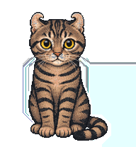</td><td>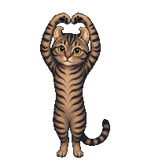</td><td></td><td>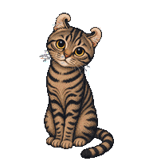</td><td>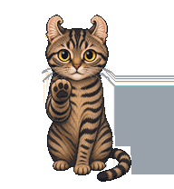</td>
  </tr>
</table>

<table>
  <tr>
    <th>Name</th>
    <td colspan="5"><a href="https://github.com/huaqingai/awesome-codex-pets/tree/main/pets/fleta--natewanggg">Fleta</a> - by <a href="https://github.com/NateWanggg">@NateWanggg</a> - Animals</td>
  </tr>
  <tr>
    <th>Install</th>
    <td colspan="5"><code>npx awesome-codex-pets install fleta--natewanggg</code><br/><code>curl -fsSL https://raw.githubusercontent.com/huaqingai/awesome-codex-pets/main/scripts/install-pet.sh | bash -s -- fleta--natewanggg</code></td>
  </tr>
  <tr>
    <th>Action</th>
    <th>Idle</th><th>Waving</th><th>Running</th><th>Waiting</th><th>Review</th>
  </tr>
  <tr>
    <th>Preview</th>
    <td>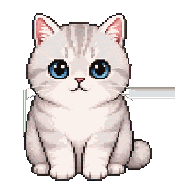</td><td></td><td>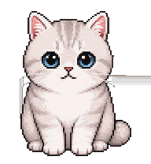</td><td>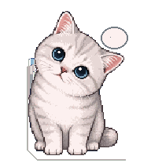</td><td></td>
  </tr>
</table>

<table>
  <tr>
    <th>Name</th>
    <td colspan="5"><a href="https://danieloleary.github.io/teddy-v31/">Teddy</a> - by <a href="https://github.com/danieloleary">@Daniel O'Leary</a> - Animals</td>
  </tr>
  <tr>
    <th>Install</th>
    <td colspan="5"><code>npx awesome-codex-pets install teddy--danieloleary</code><br/><code>curl -fsSL https://raw.githubusercontent.com/huaqingai/awesome-codex-pets/main/scripts/install-pet.sh | bash -s -- teddy--danieloleary</code></td>
  </tr>
  <tr>
    <th>Action</th>
    <th>Idle</th><th>Waving</th><th>Running</th><th>Waiting</th><th>Review</th>
  </tr>
  <tr>
    <th>Preview</th>
    <td></td><td></td><td></td><td></td><td></td>
  </tr>
</table>

### Original Characters

<table>
  <tr>
    <th>Name</th>
    <td colspan="5"><a href="https://github.com/netizenXuan/night-neko-codex-pet">Night Neko</a> - by <a href="https://github.com/netizenXuan">@netizenXuan</a> - Original Characters</td>
  </tr>
  <tr>
    <th>Install</th>
    <td colspan="5"><code>npx awesome-codex-pets install night-neko--netizenxuan</code><br/><code>curl -fsSL https://raw.githubusercontent.com/huaqingai/awesome-codex-pets/main/scripts/install-pet.sh | bash -s -- night-neko--netizenxuan</code></td>
  </tr>
  <tr>
    <th>Action</th>
    <th>Idle</th><th>Waving</th><th>Running</th><th>Waiting</th><th>Review</th>
  </tr>
  <tr>
    <th>Preview</th>
    <td>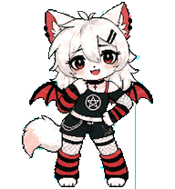</td><td></td><td>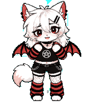</td><td>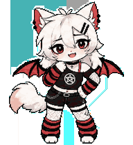</td><td>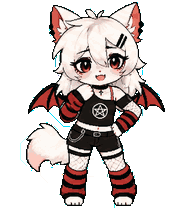</td>
  </tr>
</table>
<!-- PET_CATALOG_END -->

## Maintainer Workflow

Add a pet package under `pets/<pet-id>/`:

```text
pets/<pet-id>/
  pet.json
  spritesheet.webp
```

Then add `submission.json` metadata when available, sync the catalog, generate
previews, update the README gallery, and validate:

```bash
npm install
npm run catalog:sync
npm run previews
npm run readme
npm run validate
```

## Release Workflow

Publishing is handled by GitHub Actions when a version tag is pushed. Configure
the repository secret `NPM_TOKEN` with an npm automation token that can publish
`awesome-codex-pets`.

For the first release, commit the current `0.1.0` changes and push the matching
tag:

```bash
git push origin main
git tag v0.1.0
git push origin v0.1.0
```

For later releases, bump the version first:

```bash
npm version patch
git push origin main --follow-tags
```

The release workflow requires the tag to match `package.json` exactly, for
example `v0.1.0`. It runs `npm ci`, `npm run build`, checks that generated files
are committed, publishes to npm with provenance, and creates a GitHub Release.

The preview generator reads the Codex atlas contract: `1536x1872`, `8x9`
grid, `192x208` cells, transparent background. It writes one GIF per state to
`assets/previews/<pet-id>/<state>.gif`.

See [docs/PET_FORMAT.md](docs/PET_FORMAT.md) and
[docs/ADDING_PETS.md](docs/ADDING_PETS.md) for the package and contribution
details. See [ROADMAP.md](ROADMAP.md) for planned install, activation, and
pet-development workflow improvements.
